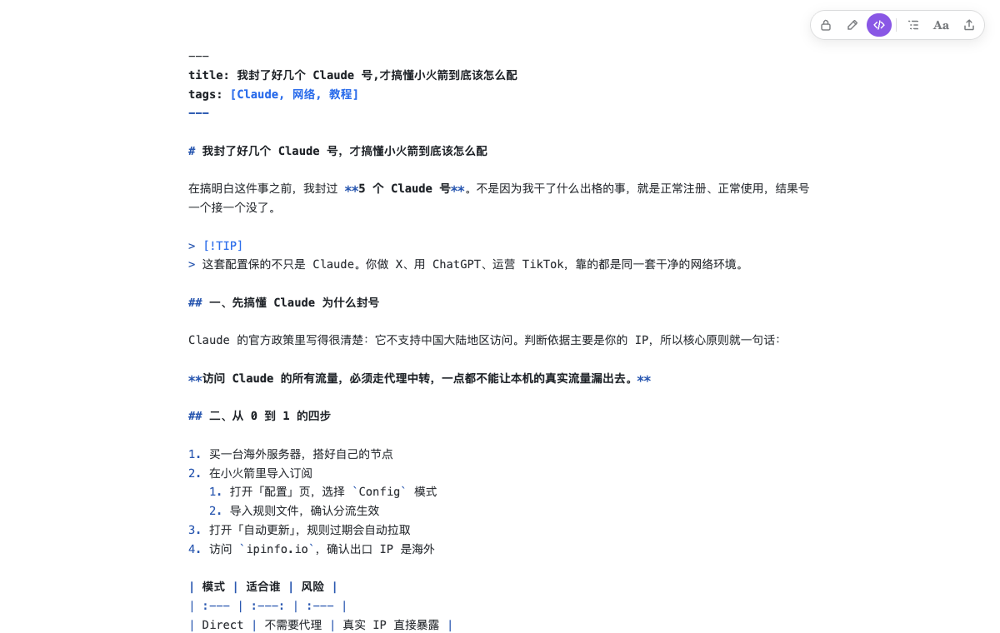
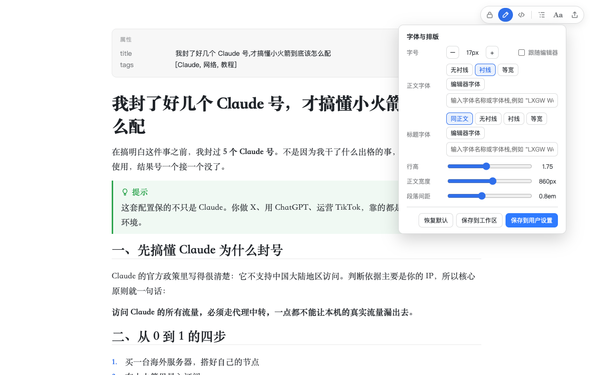
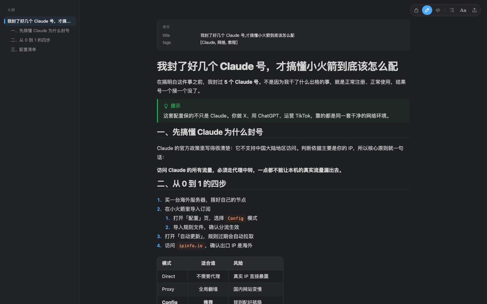

<div align="right">
  <details>
    <summary>🌐 Language</summary>
    <div>
      <div align="right">
        <p><a href="./README.md">English</a></p>
        <p><a href="./README.zh-CN.md">简体中文</a></p>
      </div>
    </div>
  </details>
</div>

<h1 align="center">
  <a href="https://github.com/Azure12355/weilanx-markdown/releases">
    <br>
  </a>
</h1>

<p align="center">English | <a href="./README.zh-CN.md">中文</a> | <a href="https://azure12355.github.io/weilanx-markdown/">Official Site</a> | <a href="#-quick-start">Quick Start</a> | <a href="#-settings">Settings</a> | <a href="#-development">Development</a> | <a href="https://github.com/Azure12355/weilanx-markdown/issues">Feedback</a><br></p>

<div align="center">

[![][vscode-shield]][vscode-link]
[![][codemirror-shield]][codemirror-link]
[![][typescript-shield]][typescript-link]
[![][i18n-shield]][i18n-link]

</div>
<div align="center">

[![][release-shield]][release-link]
[![][stars-shield]][stars-link]
[![][issues-shield]][issues-link]
[![][license-shield]][license-link]
[![][pr-shield]][pr-link]

</div>

# ✍️ Weilanx Markdown

**A live-preview Markdown editor that never rewrites your source**, for VS Code (plus Cursor and Windsurf).

Wherever the cursor isn't, `#`, `**` and link URLs fold away and you see typeset prose. Move the cursor back and the source returns. The file always holds exactly what you typed, nothing is reformatted, so git diffs stay clean and AI agents can edit the same file safely.

❤️ If you like it, a star 🌟 helps a lot!


# 🌟 Key Features

1. **Writing**:

- 👁 **Live preview** for headings, emphasis, links, images, code blocks, tables, task lists, quotes and front matter
- 🔒 ✏️ `</>` **Three modes**: Locked (read-only, fully rendered, single-click links) / Edit (live preview) / Source. Switch at the top right or cycle with `Cmd+Alt+M`
- 🧾 **Source fidelity**: rendering is a decoration layer; open, edit and undo, and the file is byte-identical
- ⌨️ `Cmd+B` `Cmd+I` `Cmd+K`; paste a URL over a selection to make a link; lists continue on Enter, Tab / Shift+Tab indent and renumber

2. **Images**:

- 📋 **Paste screenshots with `Cmd+V`**, copied files or drag & drop; falls back to the system clipboard when the webview can't read the image
- 📁 **Configurable storage path** via templates like `assets/${fileName}/${date}-${time}.${ext}`, per workspace or folder; never overwrites existing files
- 🖱 Right-click an image to reveal, copy its path, or delete the file and the link

3. **Typography**:

- 🔤 Text size follows VS Code by default; body / heading / code fonts, line height, width and paragraph spacing are live-adjustable from the **Aa** panel and savable to user or workspace settings
- 🎨 All colors come from your VS Code theme
- 💡 GitHub alerts: `> [!NOTE]` `[!TIP]` `[!IMPORTANT]` `[!WARNING]` `[!CAUTION]`

4. **Tools for writers**:

- 📊 **Status bar word count**: words · characters · 🎙 speaking time · reading time; counts the selection when you select text; hover for paragraphs, sentences, images and platform length limits
- 🧭 Outline sidebar that follows your scroll position
- 🧮 KaTeX math and Mermaid diagrams (theme-aware colors)
- 📤 Export to HTML (images inlined) and PDF (via your installed Chrome / Edge)

<table>
  <tr>
    <td width="33%"></td>
    <td width="33%"></td>
    <td width="33%"></td>
  </tr>
  <tr>
    <td align="center">🔒 Locked: read-only, fully rendered</td>
    <td align="center">✏️ Edit: source appears at the cursor</td>
    <td align="center"><code>&lt;/&gt;</code> Source</td>
  </tr>
</table>

<table>
  <tr>
    <td width="50%"></td>
    <td width="50%"></td>
  </tr>
  <tr>
    <td align="center">Aa panel: fonts, size, line height, width</td>
    <td align="center">Follows your dark theme</td>
  </tr>
</table>

# 🚀 Quick Start

1. Download [`weilanx-markdown.vsix`](https://github.com/Azure12355/weilanx-markdown/releases/latest/download/weilanx-markdown.vsix) from the latest release, or run the installer (macOS / Linux; installs into VS Code, Cursor and Windsurf):

   ```bash
   curl -fsSL https://raw.githubusercontent.com/Azure12355/weilanx-markdown/main/scripts/install.sh | bash
   ```

2. To install by hand: Extensions view `···` → **Install from VSIX...**, or `code --install-extension weilanx-markdown.vsix --force`.
3. Run **Developer: Reload Window** and open any `.md` file.

To open `.md` files with it by default, add this to `settings.json`:

```json
"workbench.editorAssociations": { "*.md": "weilanxMarkdown.editor" }
```

Agents: see [`docs/install-for-agents.md`](./docs/install-for-agents.md).

| Action | Keys |
|---|---|
| Bold / italic / link | `Cmd+B` / `Cmd+I` / `Cmd+K` |
| Cycle mode (Locked → Edit → Source) | `Cmd+Alt+M` |
| Indent / outdent list item (renumbers) | `Tab` / `Shift+Tab` |
| Zoom text in / out / reset | `Cmd+Alt+=` / `Cmd+Alt+-` / `Cmd+Alt+0` |
| Toggle outline | `Cmd+Alt+O` |
| Open link | `Cmd`-click (single click in Locked mode) |

# ⚙️ Settings

| Setting | Default | Description |
| --- | --- | --- |
| `weilanxMarkdown.image.path` | `assets/${fileName}/${date}-${time}.${ext}` | Where pasted images go. Variables: `workspaceFolder` `fileDir` `fileName` `date` `time` `timestamp` `uuid` `ext` `originalName` |
| `weilanxMarkdown.image.linkStyle` | `relative` | `relative` or `workspaceRoot` (leading `/`) |
| `weilanxMarkdown.image.altText` | `fileName` | `empty` / `fileName` / `prompt` |
| `weilanxMarkdown.font.size` | `0` | Body text size; `0` follows `editor.fontSize` |
| `weilanxMarkdown.font.family` | `sans` | `sans` / `serif` / `mono` / `editor` / any font stack |
| `weilanxMarkdown.layout.lineHeight` | `1.75` | Line height |
| `weilanxMarkdown.layout.maxWidth` | `860` | Max text width in px; `0` fills the editor |
| `weilanxMarkdown.defaultMode` | `live` | `live` / `read` / `source` |
| `weilanxMarkdown.stats.speakingRate` | `260` | Speaking rate (CJK characters per minute) |
| `weilanxMarkdown.stats.platforms` | Xiaohongshu / X / … | Platform length limits |

# 🔧 Development

```bash
npm install
npm run dev:web          # preview the editor in a browser
npm test                 # unit tests
npm run test:vscode      # integration tests inside a real VS Code
npm run package          # build weilanx-markdown.vsix
```

# 📜 License

[MIT](./LICENSE) © Azure12355

<!-- badges -->
[vscode-shield]: https://img.shields.io/badge/VS%20Code-%5E1.90-007ACC?logo=visualstudiocode&logoColor=white
[vscode-link]: https://code.visualstudio.com/
[codemirror-shield]: https://img.shields.io/badge/CodeMirror-6-D30707
[codemirror-link]: https://codemirror.net/
[typescript-shield]: https://img.shields.io/badge/TypeScript-5-3178C6?logo=typescript&logoColor=white
[typescript-link]: https://www.typescriptlang.org/
[i18n-shield]: https://img.shields.io/badge/i18n-English%20%7C%20中文-0088CC
[i18n-link]: ./README.zh-CN.md
[release-shield]: https://img.shields.io/github/v/release/Azure12355/weilanx-markdown?logo=github
[release-link]: https://github.com/Azure12355/weilanx-markdown/releases
[stars-shield]: https://img.shields.io/github/stars/Azure12355/weilanx-markdown?logo=github
[stars-link]: https://github.com/Azure12355/weilanx-markdown/stargazers
[issues-shield]: https://img.shields.io/github/issues/Azure12355/weilanx-markdown?logo=github
[issues-link]: https://github.com/Azure12355/weilanx-markdown/issues
[license-shield]: https://img.shields.io/badge/License-MIT-green.svg
[license-link]: ./LICENSE
[pr-shield]: https://img.shields.io/badge/PRs-welcome-FF6699.svg
[pr-link]: https://github.com/Azure12355/weilanx-markdown/pulls
