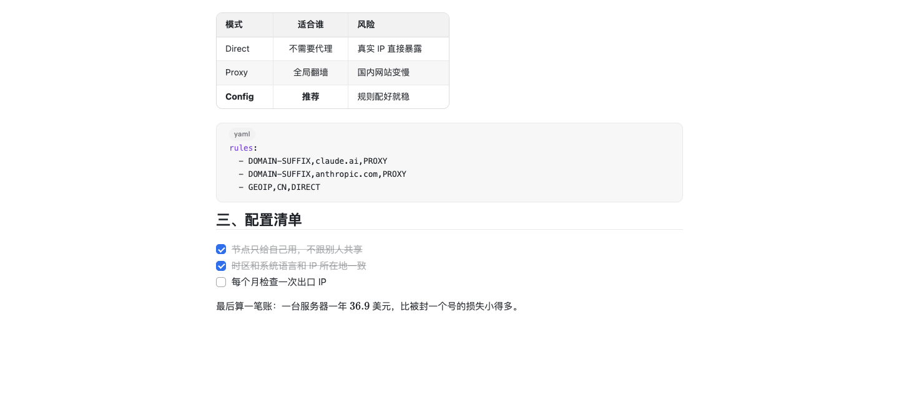

<div align="right">
  <details>
    <summary>🌐 Language</summary>
    <div>
      <div align="right">
        <p><a href="./README.md">English</a></p>
        <p><a href="./README.zh-CN.md">简体中文</a></p>
      </div>
    </div>
  </details>
</div>

<h1 align="center">
  <a href="https://github.com/Azure12355/weilanx-markdown/releases">
    <br>
  </a>
</h1>

<p align="center"><a href="./README.md">English</a> | 中文 | <a href="https://azure12355.github.io/weilanx-markdown/">官网</a> | <a href="#-快速开始">快速开始</a> | <a href="#-设置项">设置项</a> | <a href="#-开发">开发</a> | <a href="https://github.com/Azure12355/weilanx-markdown/issues">反馈</a><br></p>

<div align="center">

[![][vscode-shield]][vscode-link]
[![][codemirror-shield]][codemirror-link]
[![][typescript-shield]][typescript-link]
[![][i18n-shield]][i18n-link]

</div>
<div align="center">

[![][release-shield]][release-link]
[![][stars-shield]][stars-link]
[![][issues-shield]][issues-link]
[![][license-shield]][license-link]
[![][pr-shield]][pr-link]

</div>

# ✍️ Weilanx Markdown

**一个不会改写你原文的所见即所得 Markdown 编辑器**，给 VS Code（以及 Cursor、Windsurf）用。

光标离开的地方，`#`、`**`、链接地址这些符号都会收起来，只留下排好版的正文；光标移回去，源码就回来了。文件里存的永远是你一个字一个字敲进去的内容，不会被重新格式化，所以 git diff 干净，AI Agent 改文件也不会被打乱。

❤️ 喜欢的话点个 Star 🌟，对我帮助很大！


# 🌟 主要特性

1. **写作体验**：

- 👁 **实时预览**：标题、加粗、斜体、链接、图片、代码块、表格、任务列表、引用、front matter 全部原地渲染
- 🔒 ✏️ `</>` **三种模式**：锁定（只读、全部渲染、单击打开链接）/ 编辑（实时预览）/ 源码，右上角一键切换，`⌘⌥M` 循环
- 🧾 **原文忠实**：渲染只是一层装饰，打开、编辑、撤销后文件和原文逐字节一致
- ⌨️ `⌘B` `⌘I` `⌘K`；选中文字粘贴网址自动变成链接；列表回车自动续写，Tab / Shift+Tab 缩进并重新编号

2. **图片**：

- 📋 **截图直接 `⌘V`**：位图、访达里复制的文件、拖入的图片都支持；webview 拿不到剪贴板图片时，自动改读系统剪贴板兜底
- 📁 **存储路径可配**：`assets/${fileName}/${date}-${time}.${ext}` 这样的模板，可按工作区 / 文件夹覆盖；重名自动加序号，绝不覆盖
- 🖱 图片右键：在访达中显示、复制路径、删除图片文件和链接

3. **排版**：

- 🔤 字号默认跟随 VS Code；正文 / 标题 / 代码字体、行高、正文宽度、段落间距都能在 **Aa** 面板里实时调，一键保存到用户或工作区设置
- 🎨 配色全部取自 VS Code 主题，亮色、暗色、第三方主题都协调
- 💡 GitHub 提示块 `> [!NOTE]` `[!TIP]` `[!IMPORTANT]` `[!WARNING]` `[!CAUTION]`

4. **写作者工具**：

- 📊 **底栏字数统计**：字数 · 字符数 · 🎙 口播时长 · 阅读时长；选中文字时统计选中部分；悬停查看段落、句子、图片数，以及小红书、X、公众号摘要的字数上限对照
- 🧭 大纲侧栏，跟随滚动高亮当前章节
- 🧮 KaTeX 公式、Mermaid 图表（配色跟随主题）
- 📤 导出 HTML（图片内嵌）和 PDF（用系统里的 Chrome / Edge）

<table>
  <tr>
    <td width="33%"></td>
    <td width="33%"></td>
    <td width="33%"></td>
  </tr>
  <tr>
    <td align="center">🔒 锁定:只读,全部渲染</td>
    <td align="center">✏️ 编辑:光标所在处显示源码</td>
    <td align="center"><code>&lt;/&gt;</code> 源码</td>
  </tr>
</table>

<table>
  <tr>
    <td width="50%"></td>
    <td width="50%"></td>
  </tr>
  <tr>
    <td align="center">Aa 面板:字体、字号、行高、宽度实时调</td>
    <td align="center">跟随 VS Code 暗色主题</td>
  </tr>
</table>



# 🚀 快速开始

1. 从最新 Release 下载 [`weilanx-markdown.vsix`](https://github.com/Azure12355/weilanx-markdown/releases/latest/download/weilanx-markdown.vsix)，或者运行安装脚本（macOS / Linux，会自动装进 VS Code、Cursor、Windsurf）：

   ```bash
   curl -fsSL https://raw.githubusercontent.com/Azure12355/weilanx-markdown/main/scripts/install.sh | bash
   ```

2. 手动安装：扩展面板 `···` → **从 VSIX 安装...**，或 `code --install-extension weilanx-markdown.vsix --force`。
3. 执行 **Developer: Reload Window**，打开任意 `.md` 文件。

想让 `.md` 默认用它打开（和 Office Viewer 等其他 Markdown 编辑器二选一时），在 `settings.json` 里加一行：

```json
"workbench.editorAssociations": { "*.md": "weilanxMarkdown.editor" }
```

> 也可以把这句话发给 Claude Code / Codex / Cursor：「按照 https://github.com/Azure12355/weilanx-markdown/blob/main/docs/install-for-agents.md 帮我安装 Weilanx Markdown，装完校验。」

### ⌨️ 快捷键

| 操作 | 按键 |
|---|---|
| 加粗 / 斜体 / 链接 | `⌘B` / `⌘I` / `⌘K` |
| 切换模式（锁定 → 编辑 → 源码） | `⌘⌥M` |
| 列表缩进 / 反缩进（自动重新编号） | `Tab` / `Shift+Tab` |
| 临时放大 / 缩小 / 恢复正文 | `⌘⌥=` / `⌘⌥-` / `⌘⌥0` |
| 显示 / 隐藏大纲 | `⌘⌥O` |
| 打开链接 | `⌘` + 点击（锁定模式下直接单击） |

Windows / Linux 上把 `⌘` 换成 `Ctrl`、`⌥` 换成 `Alt`。

# ⚙️ 设置项

| 设置 | 默认值 | 说明 |
| --- | --- | --- |
| `weilanxMarkdown.image.path` | `assets/${fileName}/${date}-${time}.${ext}` | 图片保存路径。变量:`workspaceFolder` `fileDir` `fileName` `date` `time` `timestamp` `uuid` `ext` `originalName` |
| `weilanxMarkdown.image.linkStyle` | `relative` | `relative` 相对当前文件 / `workspaceRoot` 以 `/` 开头 |
| `weilanxMarkdown.image.altText` | `fileName` | `empty` / `fileName` / `prompt`(每次询问) |
| `weilanxMarkdown.image.downloadRemote` | `false` | 粘贴网页图片时下载到本地 |
| `weilanxMarkdown.font.size` | `0` | 正文字号,`0` 跟随 `editor.fontSize` |
| `weilanxMarkdown.font.family` | `sans` | `sans` / `serif` / `mono` / `editor` / 自定义字体栈 |
| `weilanxMarkdown.font.headingFamily` | `""` | 标题字体,空 = 同正文 |
| `weilanxMarkdown.font.codeFamily` | `editor` | 代码字体 |
| `weilanxMarkdown.layout.lineHeight` | `1.75` | 行高 |
| `weilanxMarkdown.layout.maxWidth` | `860` | 正文最大宽度(px),`0` 铺满 |
| `weilanxMarkdown.layout.paragraphSpacing` | `0.8` | 段落间距(em) |
| `weilanxMarkdown.defaultMode` | `live` | 打开时的模式:`live` / `read` / `source` |
| `weilanxMarkdown.stats.speakingRate` | `260` | 口播语速(中文字 / 分钟) |
| `weilanxMarkdown.stats.platforms` | 小红书 / X / 公众号… | 平台字数上限,`unit` 可选 `chars` / `words` / `x` |
| `weilanxMarkdown.export.browserPath` | `""` | 导出 PDF 用的浏览器路径,空则自动查找 |

所有图片和排版设置都可以写在工作区或文件夹的 `.vscode/settings.json` 里单独覆盖，比如博客目录用 `/static/...`，自媒体目录用 `assets/...`。

# 🔧 开发

```bash
npm install
npm run dev:web          # 在浏览器里预览编辑器(示例文档 + 模拟宿主)
npm test                 # 单元测试:图片路径、列表编号、字数统计、导出
npm run test:vscode      # 在真实 VS Code 里跑集成测试(会下载一个测试用 VS Code)
npm run typecheck
npm run package          # 生成 weilanx-markdown.vsix
```

| 目录 | 作用 |
|---|---|
| `src/core` | 图片路径模板、列表编号、字数统计、大纲、导出 HTML(纯 TS,可单测) |
| `src/vscode` | 自定义编辑器、增量同步、图片落盘、剪贴板兜底、底栏统计、导出 PDF |
| `webview/src` | CodeMirror 6 编辑器:实时预览装饰、粘贴、模式切换、Aa 面板、大纲 |

# 📝 路线图

- 🖼 图片压缩 / 转 WebP、上传图床
- 📋 表格可视化编辑
- 🔍 Markdown 文件之间的 `[[双链]]`
- 🏪 上架 VS Code 插件市场

# 🤝 参与贡献

欢迎提 Issue 和 Pull Request！提交前请先跑通 `npm test` 和 `npm run typecheck`。

# 📜 开源协议

[MIT](./LICENSE) © Azure12355

<!-- badges -->
[vscode-shield]: https://img.shields.io/badge/VS%20Code-%5E1.90-007ACC?logo=visualstudiocode&logoColor=white
[vscode-link]: https://code.visualstudio.com/
[codemirror-shield]: https://img.shields.io/badge/CodeMirror-6-D30707
[codemirror-link]: https://codemirror.net/
[typescript-shield]: https://img.shields.io/badge/TypeScript-5-3178C6?logo=typescript&logoColor=white
[typescript-link]: https://www.typescriptlang.org/
[i18n-shield]: https://img.shields.io/badge/i18n-English%20%7C%20中文-0088CC
[i18n-link]: ./README.md
[release-shield]: https://img.shields.io/github/v/release/Azure12355/weilanx-markdown?logo=github
[release-link]: https://github.com/Azure12355/weilanx-markdown/releases
[stars-shield]: https://img.shields.io/github/stars/Azure12355/weilanx-markdown?logo=github
[stars-link]: https://github.com/Azure12355/weilanx-markdown/stargazers
[issues-shield]: https://img.shields.io/github/issues/Azure12355/weilanx-markdown?logo=github
[issues-link]: https://github.com/Azure12355/weilanx-markdown/issues
[license-shield]: https://img.shields.io/badge/License-MIT-green.svg
[license-link]: ./LICENSE
[pr-shield]: https://img.shields.io/badge/PRs-welcome-FF6699.svg
[pr-link]: https://github.com/Azure12355/weilanx-markdown/pulls
