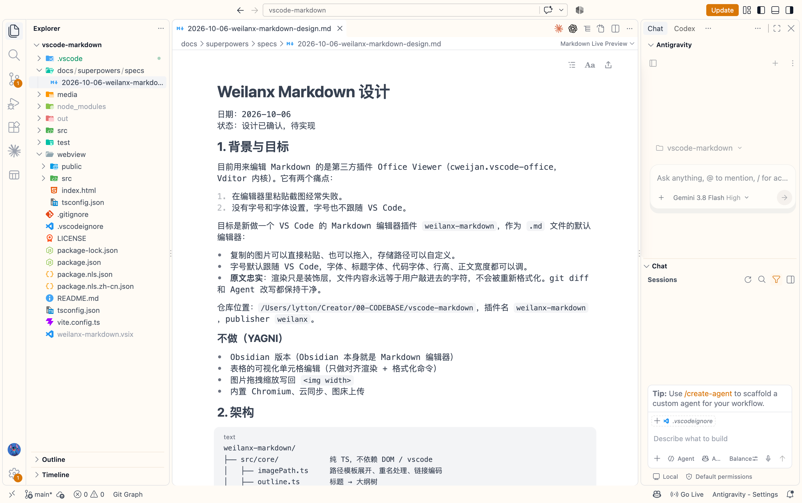

# Weilanx Markdown 设计

日期：2026-10-06
状态：设计已确认，待实现

## 1. 背景与目标

目前用来编辑 Markdown 的是第三方插件 Office Viewer（cweijan.vscode-office，Vditor 内核）。它有两个痛点：

1. 在编辑器里粘贴截图经常失败。
2. 没有字号和字体设置，字号也不跟随 VS Code。



目标是新做一个 VS Code 的 Markdown 编辑器插件 `weilanx-markdown`，作为 `.md` 文件的默认编辑器：

- 复制的图片可以直接粘贴、也可以拖入，存储路径可以自定义。
- 字号默认跟随 VS Code，字体、标题字体、代码字体、行高、正文宽度都可以调。
- **原文忠实**：渲染只是装饰层，文件内容永远等于用户敲进去的字符，不会被重新格式化。git diff 和 Agent 改写都保持干净。

仓库：`Azure12355/weilanx-markdown`，插件名 `weilanx-markdown`，publisher `weilanx`。

### 不做（YAGNI）

- Obsidian 版本（Obsidian 本身就是 Markdown 编辑器）
- 表格的可视化单元格编辑（只做对齐渲染 + 格式化命令）
- 图片拖拽缩放写回 ``
- 内置 Chromium、云同步、图床上传

## 2. 架构

```
weilanx-markdown/
├── src/core/            纯 TS，不依赖 DOM / vscode
│   ├── imagePath.ts     路径模板展开、重名处理、链接编码
│   ├── outline.ts       标题 → 大纲树
│   └── exportHtml.ts    Markdown → 独立 HTML
├── src/vscode/
│   ├── extension.ts     注册编辑器、命令、DocumentSymbol
│   ├── editor.ts        CustomTextEditorProvider：增量同步、设置推送
│   ├── images.ts        图片落盘、复制、下载、系统剪贴板兜底
│   └── exportPdf.ts     调用系统 Chrome / Edge 无头打印
├── webview/src/
│   ├── main.ts          CodeMirror 6 初始化、与宿主通信
│   ├── livePreview/     各元素的渲染装饰与组件
│   ├── paste.ts         粘贴 / 拖入
│   ├── outline.ts       大纲侧栏
│   ├── typography.ts    字体设置 → CSS 变量，「Aa」面板
│   └── style.css
└── test/
```

技术栈：TypeScript、CodeMirror 6（`@codemirror/lang-markdown` + Lezer 语法树、GFM 扩展）、KaTeX、Mermaid（按需懒加载）、Vite 打包 webview、esbuild 打包扩展端、node:test + tsx 单测。所有资源都在本地，不走 CDN。

### 2.1 数据流

1. `CustomTextEditorProvider` 绑定 `*.md`，priority `default`；文件即 TextDocument，撤销、保存、脏标记、git diff 都由 VS Code 原生提供。编辑器标题栏提供「用文本编辑器打开」。
2. **webview → 文档**：每次事务把 CodeMirror 的 `ChangeSet` 序列化为 `[from, to, insert][]` 发给扩展端，扩展端用 `WorkspaceEdit` 只替换对应区间（按 offset 转 Position）。不整篇替换。
3. **文档 → webview**：`onDidChangeTextDocument` 收到的变化如果不是自己发出的，就把 `contentChanges`（rangeOffset、rangeLength、text）发给 webview 按位置应用；CodeMirror 自动映射光标和选区，滚动位置不变。
4. **防回环**：webview 发出的每批修改带递增序号；扩展端在应用期间记录 pending，收到对应的文档变化时跳过回推。两端内容出现不一致时（比如序号丢失），扩展端推送全文让 webview 重置，光标按行列尽量恢复。
5. **撤销**：优先让 `⌘Z` / `⌘⇧Z` 走 VS Code 的文档撤销，变化通过第 3 步回到 webview。焦点在 webview 里时这条路是否生效属于 M1 技术验证项；不生效则改用 CodeMirror 自带的 history 扩展，并注册 `weilanxMarkdown.undo` / `redo` 命令绑定这两个快捷键转发给 webview（与思维导图插件同样的做法），撤销产生的修改照常按第 2 步同步回文档。

## 3. 粘贴与拖入图片

### 3.1 来源与处理

| 来源 | 处理 |
|---|---|
| 剪贴板位图（截图、网页或聊天软件「复制图片」） | 保存为文件（默认 png），插入链接 |
| 复制的图片文件（访达 / 资源管理器） | 复制到目标路径，保留原扩展名 |
| 从访达拖入 | 同上 |
| 从 VS Code 资源管理器拖入工作区内已有的图片 | 不复制，直接插入相对链接 |
| 网页图片链接 / HTML | 默认插入远程链接；`downloadRemote: true` 时下载到本地再插入 |

### 3.2 设置

均支持工作区 / 文件夹级覆盖：

```jsonc
"weilanxMarkdown.image.path": "assets/${fileName}/${date}-${time}.${ext}",
"weilanxMarkdown.image.linkStyle": "relative",   // relative | workspaceRoot
"weilanxMarkdown.image.altText": "fileName",     // empty | fileName | prompt
"weilanxMarkdown.image.downloadRemote": false
```

- `path` 相对于当前 `.md` 所在目录；以 `${workspaceFolder}` 开头或为绝对路径时按字面解析。
- 变量：`${workspaceFolder}` `${fileDir}` `${fileName}`（不含扩展名）`${date}`（YYYYMMDD）`${time}`（HHmmss）`${timestamp}`（毫秒）`${uuid}`（8 位）`${ext}` `${originalName}`（复制文件时的原文件名，不含扩展名；位图时等于 `image`）。
- `linkStyle: workspaceRoot` 时插入 `/assets/...`（静态站点用）。
- `altText: fileName` 用不含扩展名的文件名；`prompt` 每次弹输入框。

### 3.3 规则

- 目标文件已存在时依次尝试 `-1`、`-2`……，绝不覆盖。
- 链接路径含空格或非 ASCII 字符时写成 ``。
- 先在光标处插入占位符 ``，写盘完成后替换为最终链接；失败则删除占位符并提示原因。多张图每张一行。
- 撤销只撤销链接文字，不删除磁盘文件。
- 图片上的右键菜单：在访达中显示、复制路径、删除图片文件和链接（需确认）。

### 3.4 剪贴板兜底（先做技术验证）

实现的第一步：验证 VS Code webview 在 `⌘V` 时 `paste` 事件的 `clipboardData` 能否拿到位图和文件。拿不到时，webview 通知扩展端，扩展端读系统剪贴板：macOS 用 `osascript` 把 PNG 数据写到临时文件，Windows 用 PowerShell `Get-Clipboard -Format Image`，Linux 用 `xclip`（可选）。

确定的逻辑推演的效果

## 4. 字体与排版

默认跟随 VS Code：正文字号等于 `editor.fontSize`；配色使用 VS Code 主题变量（背景、前景、链接、选区、代码块背景），切换主题时实时更新。

```jsonc
"weilanxMarkdown.font.size": 0,              // 0 = 跟随 editor.fontSize
"weilanxMarkdown.font.family": "sans",       // sans | serif | mono | editor | 自定义字体栈
"weilanxMarkdown.font.headingFamily": "",    // 空 = 同正文
"weilanxMarkdown.font.codeFamily": "editor", // editor = 跟随 editor.fontFamily
"weilanxMarkdown.layout.lineHeight": 1.75,
"weilanxMarkdown.layout.maxWidth": 860,      // px，0 = 铺满
"weilanxMarkdown.layout.paragraphSpacing": 0.8 // em
```

预设字体栈：
- `sans`：`"PingFang SC", "Microsoft YaHei", Inter, system-ui, sans-serif`
- `serif`：`"Source Han Serif SC", "Songti SC", SimSun, Georgia, serif`
- `mono`：`editor.fontFamily` + 中文回退

**「Aa」面板**：编辑器右上角按钮，实时调整字号（滑块 + −/+）、字体、标题字体、行高、正文宽度；底部选择「保存到用户设置」或「保存到当前工作区」，写回上述设置项。设置项变化时（包括在 settings.json 里改）立即推送到所有打开的编辑器。

**快捷键**：`⌘⌥=` / `⌘⌥-` 临时放大缩小正文，`⌘⌥0` 恢复（不占用 `⌘=`，避免和 VS Code 整体缩放冲突）。

## 5. 实时预览

光标所在行（多行块为整个块）显示源码，其余位置显示渲染效果。用 CodeMirror 的 Decoration（`replace` / `mark` / `widget` / `line`）实现，基于 Lezer 语法树，只处理可见区域。

| 元素 | 渲染 | 光标进入 |
|---|---|---|
| ATX 标题 | 隐藏 `#`，按级别字号与字重 | 显示 `## ` |
| 粗体 / 斜体 / 删除线 / 行内代码 | 隐藏标记，只保留样式 | 显示标记 |
| 链接 | 显示文字为链接样式；`⌘` + 点击打开（`.md` 相对路径在 VS Code 打开，其余交给系统） | 显示源码 |
| 图片 | 该行下方显示图片（宽度不超过正文宽度），加载失败显示占位与路径 | 源码 + 图片 |
| 代码块 | 带高亮的卡片，右上角显示语言与复制按钮 | 显示围栏 |
| mermaid 代码块 | 渲染为图表 | 源码，图表在下方实时更新 |
| `$…$` / `$$…$$` | KaTeX | 显示源码 |
| 任务列表 | 可点击复选框，点击改写原文 `[ ]` / `[x]` | 显示源码 |
| 表格 | 对齐的网格（只读） | 整表显示源码；命令「格式化表格」对齐竖线 |
| 引用 / 分割线 / 无序列表 | 左竖条 / 横线 / 圆点 | 显示源码 |
| YAML front matter | 折叠为「属性」卡片 | 展开源码 |

**编辑辅助**：`⌘B` 粗体、`⌘I` 斜体、`⌘K` 链接；选中文字时粘贴 URL 自动变成 `[文字](url)`；列表与引用回车续写，Tab / Shift+Tab 缩进。

## 6. 大纲与导出

- **大纲侧栏**：左侧可收起；按标题层级生成目录，点击跳转，随滚动高亮当前章节，可折叠。同时实现 `DocumentSymbolProvider`，接入 VS Code 自带「大纲」视图。
- **导出 HTML**：单文件，本地图片转 base64 内嵌，带当前字体与主题样式，公式和 Mermaid 预渲染。
- **导出 PDF**：先生成同样的 HTML，再用系统 Chrome / Edge（`--headless --print-to-pdf`）打印；找不到浏览器时提示安装或改用导出 HTML。

## 7. 分期

| 里程碑 | 内容 |
|---|---|
| M1 能用 | 技术验证（剪贴板位图、webview 内撤销）；自定义编辑器 + 增量同步；实时预览（标题、强调、链接、图片、代码块、列表、引用）；粘贴 / 拖入图片 + 路径设置；字体设置 + 「Aa」面板 |
| M2 好用 | 大纲侧栏 + DocumentSymbol；任务列表；表格渲染与格式化；front matter 卡片；快捷键与编辑辅助 |
| M3 富内容 | KaTeX、Mermaid、导出 HTML / PDF |
| M4 收尾 | 中英文界面、README、官网、开源 |

## 8. 测试

- **单元测试**：路径模板（变量展开、相对 / 绝对 / workspaceRoot、重名、空格与中文编码）、大纲解析、导出 HTML。
- **无头浏览器**（playwright-cli，webview 预览页）：模拟粘贴位图与文件、拖入；实时预览的显隐规则；外部修改后光标与滚动不跳；打开、编辑、撤销后文档内容与磁盘逐字节一致。
- **VS Code 实测**：在博客目录作为默认 Markdown 编辑器使用，重点验证截图粘贴和设置覆盖。
